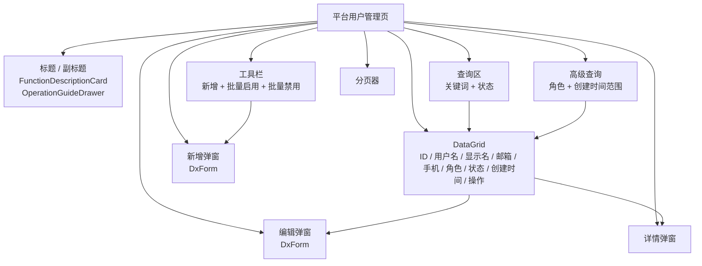

# 租户平台 — 平台用户管理页面

> 本文件是"极细化业务实施提示词"的样板，按照 `03-frontend/07-business-prompt-template.md` 模板编写。
> 其他业务模块提示词必须达到同样的详细程度。

---

## 任务信息

| 属性 | 值 |
| ------ | --- |
| 任务编号 | F2-2 |
| 所属阶段 | 层级 2：业务页面层 |
| 依赖任务 | F1-1 主布局 |
| 预计文件数 | 10+ 个（含语言文件） |
| 新前端项目路径 | `src/WebTenantPlatfrom` |

---

## 当前执行模型（Epic / Slice）

本文件是 **Epic 合同**，定义 F2-2 模块的完整目标。实际执行时，必须拆为以下 slice：

| Slice | 目标 | 推荐时长 |
| ------ | ------ | --------- |
| F2-2A | 合同与骨架、data-testid、入口权限矩阵 | 20-30 分钟 |
| F2-2B | 搜索区、DataGrid、分页、远程加载 | 25-35 分钟 |
| F2-2C | 新增/编辑表单、字段校验、唯一性校验 | 25-35 分钟 |
| F2-2D | 查看、启用/禁用、重置密码、批量操作、按钮权限 | 20-35 分钟 |
| F2-2E | E2E、自审、README/快照同步 | 20-35 分钟 |

禁止把本文件当成“一次性做完整页”的任务说明。

---

## 需求补全矩阵

| 类别 | 显式需求 | 生产默认补全 | 待确认项 | 明确不做项 |
| ------ | --------- | ------------- | --------- | ----------- |
| 页面结构 | 标题、说明、查询、列表、弹窗、详情 | 功能说明、操作指引、空态、加载态、data-testid | 是否提供列选择器 | 导出 |
| DataGrid 能力 | 远程分页、分页器、操作列 | 焦点行、移动端列隐藏、固定操作列、默认排序决策 | 是否启用列显示/隐藏 | 行内编辑 |
| 表单 | 新增/编辑、字段校验、用户名唯一性、角色必填 | 提交 loading、失败不关闭、帮助文本决策 | 是否提供密码二次确认 | 批量导入 |
| 权限 | 行操作权限、批量操作权限 | 菜单入口和 URL 可达性矩阵 | 是否允许只读用户查看详情 | 删除后回收站 |
| 测试 | 页面渲染、CRUD、搜索、验证 | 响应式、多语言、标签字段映射、权限入口断言 | 是否增加性能相关断言 | 压测 |

---

## 缺口与待确认

1. 列显示/隐藏能力是否向最终用户开放，如不开放，需在实现和验收中明确标记为“有能力但当前禁用”。
2. 密码创建是否需要二次确认字段；若当前后端无该字段，需在页面层给出明确设计决策。
3. 只读权限用户是否允许进入详情页但不可执行更新动作，需要在权限矩阵中显式说明。

---

## 组件复用决策表

| 功能点 | 复用资产 | 当前仓库状态 | 决策 | 理由 |
| -------- | --------- | ------------- | ------ | ------ |
| 页面头部 | FunctionDescriptionCard / OperationGuideDrawer | 已存在 | 复用 | 页面头部统一 |
| 搜索区 | 统一搜索区样式规范 | 已有规范，未完全组件化 | 复用规范，按需抽象 | 避免重复布局 |
| 操作列更多菜单 | `0050_common-components-standard.md` | 已存在 | 复用 | 操作列风格统一 |
| 成功/确认提示 | `utils/notify.ts` | 已存在 | 复用 | 避免双重 t() |
| 状态标签 | 共用状态颜色策略 | 部分存在 | 复用策略，必要时提取 | 避免每页重复映射 |

---

## 前置阅读

- `.ai/prompts/03-frontend/00-governance.md` — 前端总治理
- `.ai/prompts/03-frontend/04-devextreme-templates.md` — DevExtreme 规范
- `.ai/prompts/03-frontend/05-axios-standard.md` — axios 规范
- `.ai/prompts/03-frontend/06-i18n-execution.md` — i18n 规范
- `.ai/prompts/03-frontend/03-anti-patterns.md` — 反模式清单
- `.ai/rules/frontend.md` — 前端开发规范
- `.ai/rules/i18n.md` — 国际化规范
- `.github/copilot-instructions.md` — 关键编码约束（第 7-13 条为前端约束）
- `.ai/prompts/08-platform/backend/platform-user-api.md` — 后端 API 定义

---

## DevExpress 文档查阅（强制前置步骤）

**工作流**：详见 `03-frontend/04-devextreme-templates.md` 第二节。

**本模块必须查阅的组件**：

| 组件 | 查阅问题 | 用途 |
| ------ | --------- | ------ |
| DxDataGrid | `DxDataGrid CustomStore remote paging load function skip take totalCount` | 用户列表远程分页 |
| DxForm | `DxForm validation rules required stringLength async validationCallback` | 新增/编辑表单验证 |
| DxPopup | `DxPopup content template slot visible showing hiding event` | 新增/编辑弹窗 |
| DxTagBox | `DxTagBox data-source value-expr display-expr search-enabled validation selected-items` | 用户角色多选 |
| DxSelectBox | `DxSelectBox data-source display-expr value-expr search-enabled` | 状态筛选下拉 |
| DxDateRangeBox | `DxDateRangeBox start-date end-date display-format` | 高级查询日期范围 |
| DxTextBox | `DxTextBox mode password placeholder value-changed` | 表单输入 |
| DxLoadPanel | `DxLoadPanel visible position shading` | 页面加载 |
| DxToolbar | `DxToolbar items location widget DxButton` | 工具栏 |

每个组件查阅后必须调用 `devexpress_docs_get_content` 获取全文，阅读代码示例。

---

## DevExtreme 能力矩阵

### DxDataGrid

| 能力 | 状态 | 配置 |
| ------ | ------ | ------ |
| 远程分页 | 启用 | `CustomStore + remoteOperations` |
| 默认排序 | 启用 | `CreatedAt desc` |
| 列宽策略 | 启用 | `Id=80, Phone=130, Roles=180, Status=100, CreatedAt=180, 其他 auto` |
| 固定列 | 启用 | `操作列 fixed right` |
| 列隐藏（移动端） | 启用 | `Roles=1, Phone=2, Email=3, CreatedAt=4` |
| 列显示/隐藏 | 待决策 | 需在需求确认后决定是否开放 chooser |
| 焦点行 | 启用 | 创建/编辑后定位到当前记录 |
| 行选择 | 启用 | 多选，用于批量启用/禁用 |
| 空态文案 | 启用 | `暂无数据` |
| 加载面板 | 启用 | `pageLoading` 绑定 |

### DxForm

| 能力 | 状态 | 配置 |
| ------ | ------ | ------ |
| 必填校验 | 启用 | Username / Password / DisplayName / RoleIds（新增和编辑均至少一个角色） |
| 长度校验 | 启用 | Username 3-50, Password 6-100, DisplayName 2-50 |
| 格式校验 | 启用 | Email |
| 异步唯一性校验 | 启用 | Username |
| 帮助文本 | 待决策 | 可按需要补充用户名格式说明 |
| 提交 loading | 启用 | `submitting` |
| 失败不关闭 | 启用 | 默认行为 |

### DxPopup

| 能力 | 状态 | 配置 |
| ------ | ------ | ------ |
| 创建/编辑弹窗 | 启用 | `width: 600` |
| 详情弹窗 | 启用 | 只读模式 |
| 结果弹窗 | 启用 | 重置密码成功后展示新密码 |

---

## API 端点（精确匹配）

| 操作 | HTTP 方法 | URL | 请求体 | 响应体 |
| ------ | ---------- | ----- | -------- | -------- |
| 用户列表 | GET | `/api/platform-users?Page=1&PageSize=20&Keyword=&Status=` | - | `ApiResult<PagedResult<PlatformUserRepDTO>>` |
| 用户详情 | GET | `/api/platform-users/{id}` | - | `ApiResult<PlatformUserRepDTO>` |
| 创建用户 | POST | `/api/platform-users` | `{ Username, Password, DisplayName, Email, Phone, RoleIds }` | `ApiResult<long>` |
| 更新用户 | PUT | `/api/platform-users/{id}` | `{ DisplayName, Email, Phone, RoleIds }` | `ApiResult` |
| 删除用户 | DELETE | `/api/platform-users/{id}` | - | `ApiResult` |
| 启用用户 | PUT | `/api/platform-users/{id}/enable` | - | `ApiResult` |
| 禁用用户 | PUT | `/api/platform-users/{id}/disable` | - | `ApiResult` |
| 重置密码 | PUT | `/api/platform-users/{id}/reset-password` | - | `ApiResult` |
| 检查用户名 | GET | `/api/platform-users/check-username-exists?username=xxx` | - | `ApiResult<bool>` |
| 批量启用 | PUT | `/api/platform-users/batch-enable` | `{ Ids: number[] }` | `ApiResult` |
| 批量禁用 | PUT | `/api/platform-users/batch-disable` | `{ Ids: number[] }` | `ApiResult` |

---

## 必须产出的文件

| 序号 | 文件路径 | 用途 |
| :----: | --------- | ------ |
| 1 | `src/WebTenantPlatfrom/src/views/platform-users/PlatformUsersView.vue` | 主页面 |
| 2 | `src/WebTenantPlatfrom/src/views/platform-users/PlatformUsersView.vue.zh-CN.json` | 简体中文语言 |
| 3 | `src/WebTenantPlatfrom/src/views/platform-users/PlatformUsersView.vue.en-US.json` | 英文语言 |
| 4 | `src/WebTenantPlatfrom/src/views/platform-users/PlatformUsersView.vue.ja-JP.json` | 日文语言 |
| 5 | `src/WebTenantPlatfrom/src/views/platform-users/PlatformUsersView.vue.ms-MY.json` | 马来文语言 |
| 6 | `src/WebTenantPlatfrom/src/views/platform-users/PlatformUsersView.vue.zh-TW.json` | 繁体中文语言 |
| 7 | `src/WebTenantPlatfrom/src/api/platform-users.ts` | API 封装 |
| 8 | `src/WebTenantPlatfrom/src/types/platform-users.ts` | 类型定义 |
| 9 | `src/WebTenantPlatfrom/src/router/index.ts`（追加） | 路由注册 |
| 10 | `src/WebTenantPlatfrom/src/constants/permissions.ts`（追加） | 权限码 |

---

## 页面结构

| 区域 | 组件 | 内容 |
| ------ | ------ | ------ |
| 页面标题 | `<h2>` + `$t('平台用户管理')` | 页面主标题 |
| 页面副标题 | `<p>` + `$t('管理平台级用户账号，包括创建、编辑、启用/禁用、重置密码等操作')` | 页面说明 |
| 功能说明区 | `FunctionDescriptionCard` | 说明本页面提供的核心能力 |
| 查询区 | 自定义查询栏 | 关键词 + 状态筛选 |
| 高级查询区 | 可折叠面板 | 角色筛选 + 创建时间范围 |
| 工具栏 | `DxToolbar` | 新增、批量启用、批量禁用 |
| 表格区 | `DxDataGrid` + `CustomStore` | 用户列表 |
| 分页 | `DxDataGrid` 内置 `DxPager` + `DxPaging` | 远程分页 |
| 新增弹窗 | `DxPopup` + `DxForm` | 创建用户表单 |
| 编辑弹窗 | `DxPopup` + `DxForm` | 编辑用户表单 |
| 详情抽屉 | `DxPopup`（fullScreen: false） | 用户详情只读展示 |
| 操作指南 | `OperationGuideDrawer` | 操作步骤说明 |

---

## 可视化设计审查包

### 页面结构蓝图



### 关键交互流

```mermaid
flowchart LR
  Enter[进入页面] --> Perm{"具备 platform.user.list 权限?"}
  Perm -- 否 --> Forbidden[403 / 无权限提示]
  Perm -- 是 --> Load[加载角色选项和首屏列表]
  Load --> Search[关键词 / 状态 / 角色 / 时间范围查询]
  Search --> Refresh[刷新列表]
  Refresh --> Create[新增用户]
  Refresh --> Edit[编辑用户]
  Refresh --> Detail[查看详情]
  Refresh --> Batch[批量启用 / 批量禁用]
  Refresh --> Danger[启用 / 禁用 / 重置密码 / 删除]
  Create --> ValidateCreate{"用户名、密码、显示名、角色校验通过?"}
  ValidateCreate -- 否 --> StayCreate[保留弹窗并显示校验]
  ValidateCreate -- 是 --> SubmitCreate[POST /api/platform-users]
  SubmitCreate --> DoneCreate[关闭弹窗 刷新列表 定位新记录]
  Edit --> ValidateEdit{"显示名、角色校验通过?"}
  ValidateEdit -- 否 --> StayEdit[保留弹窗并显示校验]
  ValidateEdit -- 是 --> SubmitEdit[PUT /api/platform-users/{id}]
  SubmitEdit --> DoneEdit[关闭弹窗 刷新列表 定位记录]
```

### 字段覆盖矩阵

| 字段 | 查询 | 列表 | 详情 | 新增 | 编辑 | 必填 | 只读 | 校验/说明 |
| ------ | ------ | ------ | ------ | ------ | ------ | ------ | ------ | ----------- |
| Keyword（用户名/显示名） | ✅ | - | - | - | - | 否 | 否 | 支持回车搜索 |
| Status | ✅ | ✅ | ✅ | - | - | 否 | 否 | 使用状态标签 |
| RoleId（高级查询） | ✅ | - | - | - | - | 否 | 否 | 单角色筛选 |
| CreatedAtStart / CreatedAtEnd | ✅ | ✅ | ✅ | - | - | 否 | 否 | 日期范围筛选/展示 |
| Username | - | ✅ | ✅ | ✅ | ✅ | 新增必填 | 编辑只读 | 唯一性、长度、pattern |
| Password | - | - | - | ✅ | - | 新增必填 | 否 | 长度 6-100 |
| DisplayName | - | ✅ | ✅ | ✅ | ✅ | 必填 | 否 | 长度 2-50 |
| Email | - | ✅ | ✅ | ✅ | ✅ | 否 | 否 | email 格式 |
| Phone | - | ✅ | ✅ | ✅ | ✅ | 否 | 否 | 长度 <= 20 |
| RoleIds / Roles | - | ✅ | ✅ | ✅ | ✅ | 新增/编辑必填 | 否 | 至少选择一个角色 |
| UpdatedAt | - | - | ✅ | - | - | 否 | 是 | 详情只读展示 |

### 操作/API 对照矩阵

| 操作 | 入口 | 权限 | API | 确认 | 成功反馈 | E2E |
| ------ | ------ | ------ | ----- | ------ | ---------- | --- |
| 查询 | 查询区 | `platform.user.list` | `GET /api/platform-users` | 否 | 列表刷新 | ✅ |
| 新增 | 工具栏 | `platform.user.create` | `POST /api/platform-users` | 否 | `notifySuccess('创建成功')` | ✅ |
| 编辑 | 行操作 | `platform.user.update` | `PUT /api/platform-users/{id}` | 否 | `notifySuccess('更新成功')` | ✅ |
| 查看详情 | 行操作 | `platform.user.detail` | `GET /api/platform-users/{id}` | 否 | 打开详情弹窗 | ✅ |
| 启用 | 行操作 | `platform.user.update` | `PUT /api/platform-users/{id}/enable` | 是 | `notifySuccess('启用成功')` | ✅ |
| 禁用 | 行操作 | `platform.user.update` | `PUT /api/platform-users/{id}/disable` | 是 | `notifySuccess('禁用成功')` | ✅ |
| 重置密码 | 行操作 | `platform.user.update` | `PUT /api/platform-users/{id}/reset-password` | 是 | `notifySuccess('重置密码成功')` | ✅ |
| 删除 | 行操作 | `platform.user.delete` | `DELETE /api/platform-users/{id}` | 是 | `notifySuccess('删除成功')` | ✅ |
| 批量启用 | 工具栏 | `platform.user.update` | `PUT /api/platform-users/batch-enable` | 是 | `notifySuccess('批量启用成功')` | ✅ |
| 批量禁用 | 工具栏 | `platform.user.update` | `PUT /api/platform-users/batch-disable` | 是 | `notifySuccess('批量禁用成功')` | ✅ |

### 状态反馈矩阵

| 场景 | 触发条件 | UI 承载 | 用户可见反馈 | 恢复方式 |
| ------ | --------- | --------- | ------------- | --------- |
| 首屏加载 | 初次进入页面 | `DxLoadPanel` | 页面加载中 | 自动恢复 |
| 查询无结果 | 列表返回空数据 | DataGrid `no-data-text` | `暂无数据` | 调整查询条件 |
| 无权限 | 缺少 `platform.user.list` | 403 / 无权限页面 | 无权限提示 | 返回上级或切换账号 |
| 表单校验失败 | 必填/格式/唯一性/角色校验不通过 | 新增/编辑弹窗 | 字段级错误提示且不关闭弹窗 | 修改后重试 |
| 提交中 | 创建/编辑提交进行中 | 弹窗底部按钮 + loading | 提交按钮禁用并显示 loading | 自动恢复 |
| API 失败 | 网络错误或业务失败 | 弹窗 / 页面通知 | 错误提示且保留当前上下文 | 修正后重试 |

**审查重点**：角色相关信息必须同时在高级查询、列表列、详情展示、新增表单、编辑表单中有明确归属，不能只在其中一个区域出现。

---

## 查询功能

### 通用查询条件

| 序号 | 字段名 | 标签 | 类型 | 默认值 | placeholder |
| :----: | -------- | ------ | ------ | -------- | ------------- |
| 1 | Keyword | `$t('关键词')` | DxTextBox | `''` | `$t('请输入用户名或显示名')` |
| 2 | Status | `$t('状态')` | DxSelectBox | `null`（全部） | `$t('请选择状态')` |

**状态下拉选项**：

| 值 | 显示文本 |
| :--: | --------- |
| null | `$t('全部')` |
| 1 | `$t('已启用')` |
| 2 | `$t('已禁用')` |

### 高级查询条件

| 序号 | 字段名 | 标签 | 类型 | 默认值 | placeholder |
| :----: | -------- | ------ | ------ | -------- | ------------- |
| 1 | RoleId | `$t('角色')` | DxSelectBox | `null` | `$t('请选择角色')` |
| 2 | CreatedAtStart / CreatedAtEnd | `$t('创建时间')` | DxDateRangeBox | `null` | `$t('起始日期')` ~ `$t('结束日期')` |

### 查询行为

| 行为 | 要求 |
| ------ | ------ |
| 回车搜索 | 在关键词输入框回车触发搜索 |
| 查询按钮 | `$t('查询')`，点击触发搜索 |
| 重置按钮 | `$t('重置')`，清空所有条件并重新加载 |
| 高级查询展开 | `$t('高级查询')` / `$t('收起')` 文本切换 |
| 所有文本国际化 | 所有 label、placeholder、按钮文本均使用 `$t()` |

---

## 列表与分页

### 表格组件

使用 `DxDataGrid` + `CustomStore` 实现远程分页。

### 列定义

| 序号 | data-field | caption（i18n key） | 宽度 | 可排序 | 格式化 | 说明 |
| :----: | ----------- | --------------------- | :----: | :------: | -------- | ------ |
| 1 | Id | `$t('ID')` | 80px | 否 | - | 固定宽度 |
| 2 | Username | `$t('用户名')` | auto | 是 | - | |
| 3 | DisplayName | `$t('显示名')` | auto | 否 | - | |
| 4 | Email | `$t('邮箱')` | auto | 否 | - | |
| 5 | Phone | `$t('手机')` | 130px | 否 | - | |
| 6 | Roles | `$t('角色')` | 180px | 否 | `rolesCell` | 角色名称列表/标签 |
| 7 | Status | `$t('状态')` | 100px | 否 | `statusCell` | 颜色标签 |
| 8 | CreatedAt | `$t('创建时间')` | 180px | 是 | `dateCell` | `yyyy-MM-dd HH:mm` |
| 9 | - | `$t('操作')` | 420px | 否 | `actionCell` | 操作按钮列 |

**所有 caption 必须使用 `:caption="$t('...')"` 绑定，禁止硬编码。**

### 分页配置

| 配置 | 值 |
| ------ | --- |
| 支持分页 | 是 |
| 默认页大小 | 20 |
| 可选页大小 | `[10, 20, 50, 100]` |
| 显示总数 | 是（`showInfo: true`） |
| 显示页大小选择 | 是（`showPageSizeSelector: true`） |
| 显示导航按钮 | 是（`showNavigationButtons: true`） |
| 远程分页 | 是（CustomStore） |

### 状态列颜色

| 状态值 | 显示文本 | 标签颜色 | CSS class |
| :------: | --------- | --------- | ----------- |
| 1 | `$t('已启用')` | 绿色 `#52c41a` | `status-enabled` |
| 2 | `$t('已禁用')` | 红色 `#f5222d` | `status-disabled` |

### 空状态与加载

| 状态 | 显示 |
| ------ | ------ |
| 空数据 | `:no-data-text="$t('暂无数据')"` |
| 加载中 | `DxLoadPanel`（`visible` 绑定 `pageLoading`） |

---

## 操作按钮

### 工具栏按钮

| 按钮 | 文本 | 图标 | 权限码 | 启用条件 | 点击行为 | 确认框 |
| ------ | ------ | ------ | -------- | --------- | --------- | -------- |
| 新增 | `$t('新增')` | `add` | `PLATFORM_USER_CREATE` | 始终启用 | 打开新增弹窗 | 无 |
| 批量启用 | `$t('批量启用')` | `check` | `PLATFORM_USER_ENABLE` | 选中行 > 0 | 调用 batch-enable API | `confirmAction('确认批量启用选中用户')` |
| 批量禁用 | `$t('批量禁用')` | `close` | `PLATFORM_USER_DISABLE` | 选中行 > 0 | 调用 batch-disable API | `confirmAction('确认批量禁用选中用户')` |

### 行操作按钮

| 按钮 | 文本 | 图标 | 权限码 | 显示条件 | 点击行为 | 确认框 |
| ------ | ------ | ------ | -------- | --------- | --------- | -------- |
| 查看 | `$t('查看')` | `search` | `PLATFORM_USER_VIEW` | 始终 | 打开详情抽屉 | 无 |
| 编辑 | `$t('编辑')` | `edit` | `PLATFORM_USER_UPDATE` | 始终 | 打开编辑弹窗 | 无 |
| 启用 | `$t('启用')` | `check` | `PLATFORM_USER_ENABLE` | `Status === 2`（已禁用） | 调用启用 API | `confirmAction('确认启用用户 {DisplayName}')` |
| 禁用 | `$t('禁用')` | `close` | `PLATFORM_USER_DISABLE` | `Status === 1`（已启用） | 调用禁用 API | `confirmAction('确认禁用用户 {DisplayName}')` |
| 重置密码 | `$t('重置密码')` | `key` | `PLATFORM_USER_RESET_PWD` | 始终 | 调用重置密码 API | `confirmAction('确认重置用户 {DisplayName} 的密码')` |
| 删除 | `$t('删除')` | `trash` | `PLATFORM_USER_DELETE` | 始终 | 调用删除 API | `confirmDelete(row.DisplayName)` |

### 权限码定义

```typescript
// src/constants/permissions.ts（追加）
export const PLATFORM_USER_VIEW = 'platform.user.detail'
export const PLATFORM_USER_CREATE = 'platform.user.create'
export const PLATFORM_USER_UPDATE = 'platform.user.update'
export const PLATFORM_USER_DELETE = 'platform.user.delete'
export const PLATFORM_USER_ENABLE = 'platform.user.update'
export const PLATFORM_USER_DISABLE = 'platform.user.update'
export const PLATFORM_USER_RESET_PWD = 'platform.user.update'
```

---

## 权限入口可见性矩阵

| 层级 | 权限码 | 无权限行为 | 有权限行为 |
| ------ | -------- | ----------- | ----------- |
| 菜单入口 | `platform.user.list` | 菜单隐藏 | 菜单显示 |
| 页面进入 | `platform.user.list` | 显示 403/无权限提示 | 可进入页面 |
| 查询区 | `platform.user.list` | 查询区隐藏 | 查询区显示 |
| 查看详情 | `platform.user.detail` | 查看按钮隐藏 | 查看按钮显示 |
| 新增 | `platform.user.create` | 新增按钮隐藏 | 新增按钮显示 |
| 编辑/启用/禁用/重置密码 | `platform.user.update` | 对应按钮隐藏 | 对应按钮显示 |
| 删除 | `platform.user.delete` | 删除按钮隐藏 | 删除按钮显示 |

> 默认规则：拥有 `platform.user.list` 的用户，必须能看到菜单入口并进入页面，不能出现“有查询权限但入口整体消失”的情况。

### 确认框文案（全部国际化）

| 操作 | 文案 key | 说明 |
| ------ | --------- | ------ |
| 启用 | `'确认启用用户 {name}'` | 需在 common 语言文件中有对应翻译 |
| 禁用 | `'确认禁用用户 {name}'` | 同上 |
| 重置密码 | `'确认重置用户 {name} 的密码'` | 同上 |
| 删除 | `confirmDelete(row.DisplayName)` | 使用通用删除确认 |
| 批量启用 | `'确认批量启用选中用户'` | 同上 |
| 批量禁用 | `'确认批量禁用选中用户'` | 同上 |

### 成功提示（全部国际化）

| 操作 | 调用 |
| ------ | ------ |
| 创建 | `notifySuccess('创建成功')` |
| 更新 | `notifySuccess('更新成功')` |
| 启用 | `notifySuccess('启用成功')` |
| 禁用 | `notifySuccess('禁用成功')` |
| 重置密码 | `notifySuccess('重置密码成功')` |
| 删除 | `notifySuccess('删除成功')` |
| 批量启用 | `notifySuccess('批量启用成功')` |
| 批量禁用 | `notifySuccess('批量禁用成功')` |

**注意**：`notifySuccess` 仅传 i18n key，不用 `t()` 包裹。

---

## 表单功能

### 新增表单

**标题**：`$t('新增用户')`
**组件**：`DxPopup`（`width: 600`，`height: auto`）+ `DxForm`

| 序号 | 字段名 | 标签 | 类型 | 必填 | 长度限制 | 格式校验 | 唯一性 | 默认值 | 禁用条件 | 显隐条件 |
| :----: | -------- | ------ | ------ | :----: | --------- | --------- | :------: | -------- | --------- | --------- |
| 1 | Username | `$t('用户名')` | DxTextBox | ✅ | 3-50 | `^[a-zA-Z0-9_]+$` 字母数字下划线 | ✅ async | `''` | - | - |
| 2 | Password | `$t('密码')` | DxTextBox (`mode: 'password'`) | ✅ | 6-100 | - | - | `''` | - | - |
| 3 | DisplayName | `$t('显示名')` | DxTextBox | ✅ | 2-50 | - | - | `''` | - | - |
| 4 | Email | `$t('邮箱')` | DxTextBox | ❌ | 0-100 | email 格式 | - | `''` | - | - |
| 5 | Phone | `$t('手机')` | DxTextBox | ❌ | 0-20 | - | - | `''` | - | - |
| 6 | RoleIds | `$t('角色')` | DxTagBox | ✅ | - | `length > 0` | - | `[]` | - | - |

**唯一性校验**：

- Username：调用 `GET /api/platform-users/check-username-exists?username=xxx`
- 新增时不传 `excludeId`
- DxForm async validation：

```typescript
{
  type: 'async',
  validationCallback: async (params) => {
    const exists = await checkUsernameExists(params.value)
    return !exists
  },
  message: t('用户名已存在')
}
```

**验证规则汇总**：

| 字段 | 规则类型 | 参数 | 验证消息 |
| ------ | --------- | ------ | --------- |
| Username | required | - | `$t('请输入用户名')` |
| Username | stringLength | min: 3, max: 50 | `$t('用户名长度 3-50 个字符')` |
| Username | pattern | `^[a-zA-Z0-9_]+$` | `$t('用户名仅允许字母、数字和下划线')` |
| Username | async | checkUsernameExists | `$t('用户名已存在')` |
| Password | required | - | `$t('请输入密码')` |
| Password | stringLength | min: 6, max: 100 | `$t('密码长度至少 6 个字符')` |
| DisplayName | required | - | `$t('请输入显示名')` |
| DisplayName | stringLength | min: 2, max: 50 | `$t('显示名长度 2-50 个字符')` |
| Email | email | - | `$t('请输入正确的邮箱地址')` |
| Email | stringLength | max: 100 | `$t('邮箱长度不超过 100 个字符')` |
| Phone | stringLength | max: 20 | `$t('手机号长度不超过 20 个字符')` |
| RoleIds | custom | `Array.isArray(value) && value.length > 0` | `$t('请选择至少一个角色')` |

**提交行为**：

1. 提交前：调用 `formInstance.validate()`，不通过则阻止提交
2. 提交时：`submitting.value = true`，禁用提交按钮并显示 loading
3. 提交成功：关闭弹窗 → `notifySuccess('创建成功')` → 刷新列表
4. 提交失败：axios 拦截器自动显示错误 → 不关闭弹窗 → `submitting.value = false`

**弹窗按钮**：

| 按钮 | 文本 | 位置 | 行为 |
| ------ | ------ | ------ | ------ |
| 提交 | `$t('确定')` | 弹窗底部右侧 | 提交表单，`submitting` 时 disabled + loading |
| 取消 | `$t('取消')` | 弹窗底部左侧 | 关闭弹窗，重置表单 |

### 编辑表单

**标题**：`$t('编辑用户')`
**组件**：`DxPopup`（`width: 600`，`height: auto`）+ `DxForm`

| 序号 | 字段名 | 标签 | 类型 | 必填 | 长度限制 | 格式校验 | 唯一性 | 默认值 | 禁用条件 | 显隐条件 |
| :----: | -------- | ------ | ------ | :----: | --------- | --------- | :------: | -------- | --------- | --------- |
| 1 | Username | `$t('用户名')` | DxTextBox | - | - | - | - | 从数据加载 | **始终禁用** | 显示（只读） |
| 2 | DisplayName | `$t('显示名')` | DxTextBox | ✅ | 2-50 | - | - | 从数据加载 | - | - |
| 3 | Email | `$t('邮箱')` | DxTextBox | ❌ | 0-100 | email 格式 | - | 从数据加载 | - | - |
| 4 | Phone | `$t('手机')` | DxTextBox | ❌ | 0-20 | - | - | 从数据加载 | - | - |
| 5 | RoleIds | `$t('角色')` | DxTagBox | ✅ | - | `length > 0` | - | 从数据加载 | - | - |

**注意**：编辑时 Username 字段为只读（`disabled: true`），不可修改。Password 字段不在编辑表单中（密码通过"重置密码"操作修改）。编辑场景同样必须要求至少选择一个角色，禁止把用户保存为无角色状态。

**提交行为**：同新增表单，成功提示为 `notifySuccess('更新成功')`。

### 详情展示

**标题**：`$t('用户详情')`
**组件**：`DxPopup`（只读展示）

展示字段：

| 序号 | 字段名 | 标签 | 格式化 |
| :----: | -------- | ------ | -------- |
| 1 | Id | `$t('ID')` | - |
| 2 | Username | `$t('用户名')` | - |
| 3 | DisplayName | `$t('显示名')` | - |
| 4 | Email | `$t('邮箱')` | - |
| 5 | Phone | `$t('手机')` | - |
| 6 | Status | `$t('状态')` | 状态标签 |
| 7 | Roles | `$t('角色')` | 角色名称列表 |
| 8 | CreatedAt | `$t('创建时间')` | `yyyy-MM-dd HH:mm:ss` |
| 9 | UpdatedAt | `$t('更新时间')` | `yyyy-MM-dd HH:mm:ss` |

---

## 类型定义

```typescript
// src/types/platform-users.ts

/** 用户创建请求 */
export interface PlatformUserCreateReqDTO {
  Username: string
  Password: string
  DisplayName: string
  Email: string
  Phone: string
  RoleIds: number[]
}

/** 用户更新请求 */
export interface PlatformUserUpdateReqDTO {
  DisplayName: string
  Email: string
  Phone: string
  RoleIds: number[]
}

/** 用户响应 */
export interface PlatformUserRepDTO {
  Id: number
  Username: string
  DisplayName: string
  Email: string
  Phone: string
  Status: number
  Roles: PlatformUserRoleDTO[]
  CreatedAt: string
  UpdatedAt: string
}

/** 用户角色 */
export interface PlatformUserRoleDTO {
  Id: number
  Name: string
}
```

---

## 国际化要求

### 组件级 key（放入 `PlatformUsersView.vue.{locale}.json`）

| key | zh-CN | en-US | ja-JP | ms-MY | zh-TW |
| ----- | ------- | ------- | ------- | ------- | ------- |
| 平台用户管理 | 平台用户管理 | Platform User Management | プラットフォームユーザー管理 | Pengurusan Pengguna Platform | 平台使用者管理 |
| 管理平台级用户账号，包括创建、编辑、启用/禁用、重置密码等操作 | (同key) | Manage platform user accounts including create, edit, enable/disable, and reset password | プラットフォームユーザーアカウントの作成、編集、有効/無効、パスワードリセットなどの操作を管理します | Urus akaun pengguna platform termasuk cipta, edit, aktif/nyahaktif dan set semula kata laluan | 管理平台級使用者帳號，包括建立、編輯、啟用/停用、重設密碼等操作 |
| 请输入用户名或显示名 | 请输入用户名或显示名 | Enter username or display name | ユーザー名または表示名を入力 | Masukkan nama pengguna atau nama paparan | 請輸入使用者名稱或顯示名稱 |
| 请选择状态 | 请选择状态 | Select status | ステータスを選択 | Pilih status | 請選擇狀態 |
| 请选择角色 | 请选择角色 | Select role | ロールを選択 | Pilih peranan | 請選擇角色 |
| 请选择至少一个角色 | 请选择至少一个角色 | Select at least one role | 少なくとも1つのロールを選択 | Pilih sekurang-kurangnya satu peranan | 請至少選擇一個角色 |
| 高级查询 | 高级查询 | Advanced Search | 詳細検索 | Carian Lanjutan | 進階查詢 |
| 收起 | 收起 | Collapse | 閉じる | Tutup | 收起 |
| 用户名 | 用户名 | Username | ユーザー名 | Nama Pengguna | 使用者名稱 |
| 显示名 | 显示名 | Display Name | 表示名 | Nama Paparan | 顯示名稱 |
| 邮箱 | 邮箱 | Email | メール | E-mel | 電子郵件 |
| 手机 | 手机 | Phone | 電話 | Telefon | 手機 |
| 角色 | 角色 | Roles | ロール | Peranan | 角色 |
| 新增用户 | 新增用户 | Create User | ユーザー作成 | Cipta Pengguna | 新增使用者 |
| 编辑用户 | 编辑用户 | Edit User | ユーザー編集 | Edit Pengguna | 編輯使用者 |
| 用户详情 | 用户详情 | User Details | ユーザー詳細 | Butiran Pengguna | 使用者詳情 |
| 密码 | 密码 | Password | パスワード | Kata Laluan | 密碼 |
| 请输入用户名 | 请输入用户名 | Enter username | ユーザー名を入力 | Masukkan nama pengguna | 請輸入使用者名稱 |
| 请输入密码 | 请输入密码 | Enter password | パスワードを入力 | Masukkan kata laluan | 請輸入密碼 |
| 请输入显示名 | 请输入显示名 | Enter display name | 表示名を入力 | Masukkan nama paparan | 請輸入顯示名稱 |
| 用户名长度 3-50 个字符 | 用户名长度 3-50 个字符 | Username must be 3-50 characters | ユーザー名は3-50文字 | Nama pengguna mestilah 3-50 aksara | 使用者名稱長度 3-50 個字元 |
| 用户名仅允许字母、数字和下划线 | 用户名仅允许字母、数字和下划线 | Username can only contain letters, numbers and underscores | ユーザー名は英数字とアンダースコアのみ | Nama pengguna hanya boleh mengandungi huruf, nombor dan garis bawah | 使用者名稱僅允許字母、數字和底線 |
| 用户名已存在 | 用户名已存在 | Username already exists | ユーザー名は既に存在します | Nama pengguna sudah wujud | 使用者名稱已存在 |
| 密码长度至少 6 个字符 | 密码长度至少 6 个字符 | Password must be at least 6 characters | パスワードは6文字以上 | Kata laluan mestilah sekurang-kurangnya 6 aksara | 密碼長度至少 6 個字元 |
| 显示名长度 2-50 个字符 | 显示名长度 2-50 个字符 | Display name must be 2-50 characters | 表示名は2-50文字 | Nama paparan mestilah 2-50 aksara | 顯示名稱長度 2-50 個字元 |
| 请输入正确的邮箱地址 | 请输入正确的邮箱地址 | Please enter a valid email | 正しいメールアドレスを入力してください | Sila masukkan e-mel yang sah | 請輸入正確的電子郵件地址 |
| 确认启用用户 {name} | 确认启用用户 {name} | Confirm enable user {name} | ユーザー {name} を有効にしますか | Sahkan aktifkan pengguna {name} | 確認啟用使用者 {name} |
| 确认禁用用户 {name} | 确认禁用用户 {name} | Confirm disable user {name} | ユーザー {name} を無効にしますか | Sahkan nyahaktifkan pengguna {name} | 確認停用使用者 {name} |
| 确认重置用户 {name} 的密码 | 确认重置用户 {name} 的密码 | Confirm reset password for user {name} | ユーザー {name} のパスワードをリセットしますか | Sahkan set semula kata laluan pengguna {name} | 確認重設使用者 {name} 的密碼 |
| 确认批量启用选中用户 | 确认批量启用选中用户 | Confirm enable selected users | 選択したユーザーを一括有効にしますか | Sahkan aktifkan pengguna yang dipilih | 確認批量啟用選中使用者 |
| 确认批量禁用选中用户 | 确认批量禁用选中用户 | Confirm disable selected users | 選択したユーザーを一括無効にしますか | Sahkan nyahaktifkan pengguna yang dipilih | 確認批量停用選中使用者 |
| 重置密码成功 | 重置密码成功 | Password reset successful | パスワードリセット成功 | Kata laluan berjaya diset semula | 重設密碼成功 |
| 批量启用成功 | 批量启用成功 | Batch enable successful | 一括有効化成功 | Aktifkan kelompok berjaya | 批量啟用成功 |
| 批量禁用成功 | 批量禁用成功 | Batch disable successful | 一括無効化成功 | Nyahaktifkan kelompok berjaya | 批量停用成功 |

### common key（在组件级文件中值为 `null`）

以下 key 已存在于 common 语言文件中，组件级文件中写 `null`：

`查询`、`重置`、`新增`、`编辑`、`删除`、`查看`、`启用`、`禁用`、`确定`、`取消`、`操作`、`ID`、`状态`、`创建时间`、`更新时间`、`已启用`、`已禁用`、`全部`、`暂无数据`、`功能说明`、`操作指南`、`创建成功`、`更新成功`、`删除成功`、`启用成功`、`禁用成功`、`重置密码`

---

## E2E 测试证据矩阵

| 场景 | 测试文件 | 核心断言 | 前置数据 |
| ------ | --------- | --------- | --------- |
| 页面渲染 | `platform-users.spec.ts` | 标题、搜索区、列表、分页可见 | 种子管理员 |
| 列表加载 | `platform-users.spec.ts` | DataGrid 行存在，列头完整（包含角色列） | 种子管理员 |
| 创建成功路径 | `platform-users.spec.ts` | 新增后列表刷新并定位到新记录 | 测试用户数据 |
| 表单失败路径 | `platform-users.spec.ts` | 用户名为空、重复或未选择角色时显示错误 | 无 |
| 权限入口可见性 | `platform-users.spec.ts` | 有 list 权限时菜单可见；无权限时显示 403/无权限 | 权限测试用户 |
| 标签字段映射 | `platform-users.spec.ts` | `用户名`、`手机`、`邮箱` label 与输入控件一一对应 | 无 |
| 响应式 | `platform-users.spec.ts` | 桌面/平板/手机下核心功能可见 | 无 |
| 多语言 | `platform-users.spec.ts` | 标题和主要按钮随语言切换更新 | 无 |

---

## 任务快照与缓存更新要求

1. 实际执行 F2-2 的任一 slice 时，必须更新对应 `.ai/tasks/platform-frontend/...` 任务文件中的“任务快照”。
2. 每轮结束必须输出 `.ai/workspace/session-summary-*.md`，并写清：dxdocs 查询、构建命令、E2E 命令、通过数、剩余风险。
3. 如果发现新的通用问题，例如权限入口失真、E2E 漏测、标签绑定错误，必须同步更新 `03-frontend/` 下对应提示词。

---

## 验收标准

### P0 — 功能点完整性

- [ ] 页面标题"平台用户管理"存在
- [ ] 页面副标题存在
- [ ] 功能说明卡片（FunctionDescriptionCard）存在
- [ ] 操作指南入口（OperationGuideDrawer）存在
- [ ] **查询区**包含：关键词输入框、状态下拉
- [ ] **高级查询**包含：角色下拉、创建时间范围
- [ ] 高级查询支持展开/收起
- [ ] **表格列**包含：ID、用户名、显示名、邮箱、手机、角色、状态、创建时间、操作
- [ ] **分页**包含：页大小选择（10/20/50/100）、总数显示、导航按钮
- [ ] 远程分页通过 CustomStore 实现
- [ ] **工具栏**包含：新增按钮、批量启用、批量禁用
- [ ] **行操作**包含：查看、编辑、启用、禁用、重置密码、删除（共 6 个）
- [ ] **新增弹窗**包含字段：用户名、密码、显示名、邮箱、手机、角色
- [ ] **编辑弹窗**包含字段：用户名（只读）、显示名、邮箱、手机、角色（无密码）
- [ ] **详情抽屉**展示：ID、用户名、显示名、邮箱、手机、状态、角色、创建时间、更新时间

### P1 — 业务规则完整性

- [ ] 用户名 `required` 验证
- [ ] 用户名 `stringLength`（3-50）验证
- [ ] 用户名 `pattern`（字母数字下划线）验证
- [ ] 用户名 `async` 唯一性验证（新增时）
- [ ] 编辑时用户名字段 disabled（不可修改）
- [ ] 密码 `required` 验证
- [ ] 密码 `stringLength`（min: 6）验证
- [ ] 显示名 `required` 验证
- [ ] 显示名 `stringLength`（2-50）验证
- [ ] 角色 `required` / `length > 0` 验证（新增和编辑）
- [ ] 邮箱 `email` 格式验证
- [ ] 每个操作按钮有权限码控制（`v-if="perm.has(...)"`)
- [ ] 启用按钮仅在 `Status === 2` 时显示
- [ ] 禁用按钮仅在 `Status === 1` 时显示
- [ ] 删除有 `confirmDelete` 确认
- [ ] 启用/禁用/重置密码有 `confirmAction` 确认
- [ ] 批量操作有 `confirmAction` 确认
- [ ] 提交时有 `submitting` loading 状态
- [ ] 提交成功后关闭弹窗并刷新列表
- [ ] 提交失败后不关闭弹窗

### P2 — 国际化完整性

- [ ] 5 个语言文件已创建
- [ ] 5 个语言文件 key 完全一致
- [ ] DxColumn caption 全部使用 `:caption="$t()"`
- [ ] `grep -rn 'caption="' PlatformUsersView.vue | grep -v ':caption'` 结果为 0
- [ ] `notifySuccess` / `confirmAction` 不双重 t()
- [ ] `grep -rn "notifySuccess(t(" PlatformUsersView.vue` 结果为 0
- [ ] 组件特有 key 在组件级语言文件中
- [ ] common key 在组件级文件中值为 null
- [ ] 所有按钮文本已国际化
- [ ] 所有查询字段 label / placeholder 已国际化
- [ ] 所有弹窗标题已国际化
- [ ] 所有验证提示消息已国际化
- [ ] 所有状态显示值已国际化
- [ ] 所有确认框文案已国际化
- [ ] 所有成功提示已国际化

### P3 — 编译与质量

- [ ] `npm run build` 通过
- [ ] 无乱码字符（`grep -rn $'\xEF\xBF\xBD'` 结果为 0）
- [ ] Code Review 自检全部通过（见 `00-governance.md` 第四节）
- [ ] 无 fetch 调用（使用 axios）
- [ ] API 封装使用 `httpGet` / `httpPost` / `httpPut` / `httpDelete`
